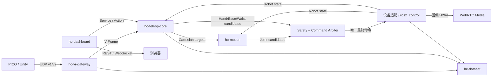

# HC 通用遥操作框架解耦计划

## 1. 总体结论

当前资源和卡顿问题并不是“Python 文件数量”本身导致，而是运行职责高度集中：

- [arm_teleop_node.py](/home/maple/test/HC-teleop-robotic/adapters/core/arm_teleop_node.py:117) 共约 2600 行，混合了 VR 映射、离合状态机、双臂、手爪、腰部、底盘、回零、碰撞、PyBullet、IK 后端和命令合并；即使使用 Motion Server，仍在 100 Hz 加载并运行 PyBullet/FK。
- [app.py](/home/maple/test/HC-teleop-robotic/middleware/core/app.py:37) 同时负责网页、VR UDP、ROS、四路相机、WebRTC、录制、回放和配置重启。
- 当前现场约为：控制 Python 进程 231 MB RSS、11.5% CPU；中间件 266 MB RSS、39 个线程。录制关闭时仍有录制子进程。
- 因此不能只拆 Git 仓库；必须同时拆运行边界、强类型接口和依赖加载边界。

目标架构：



前端、录制或 VR 网关重启都不能成为最终命令的所有者；VR 断流后由独立安全仲裁器在规定时间内安全保持。

## 2. 仓库与运行边界

| 仓库 | 主要职责 | 语言与运行方式 |
|---|---|---|
| `hc-teleop-workspace` | 当前仓最终转为元仓库；保存固定版本的 `.repos`、colcon 配置、安装说明和迁移工具，不再放业务代码 | vcstool、colcon |
| `hc-teleop-interfaces` | 所有 `.msg/.srv/.action`、QoS 合同、错误码、profile schema、兼容性测试 | ROS IDL/CMake |
| `hc-vr-gateway` | PICO 发现、UDP v1/v2 解码、序列/丢包/超时检查，发布强类型 `VrFrame` | C++ `rclcpp` |
| `hc-teleop-core` | 坐标映射、clutch/deadman、组件路由、控制租约、安全状态机、最终命令仲裁 | ROS-free C++ 核心 + `rclcpp` |
| `hc-motion` | 通用 FK/IK、MoveJ/L/P、ServoJ/P、轨迹与碰撞接口；不包含厂商驱动 | C++ |
| `hc-device-sdk` | 设备 capability schema、适配生命周期、插件发现、映射工具和一致性测试 | C++、ros2_control/pluginlib |
| `hc-dashboard` | 静态 TypeScript SPA、薄 `aiohttp` BFF；WebRTC 媒体作为独立进程 | TypeScript、少量 Python、C++/GStreamer |
| `hc-dataset` | rosbag2/MCAP 录制、目录、校验、回放、导入导出和元数据 | Python 控制面，底层直接记录 ROS CDR |
| `hc-bringup` | profile 校验、组件发现、Lifecycle/launch 编排、`hcctl doctor` | ROS 2 launch、Python CLI |

扩展仓库独立发布：

- `hc-motion-backend-v23`：保留当前 V23 的迁移兼容。
- `hc-motion-backend-robo-manip`：封装 Motion Server 和精确 ABI 依赖，保持私有且不阻塞默认构建。
- `hc-adapter-<vendor-model>`：每个厂商或设备型号一个仓库，如 OpenArmX、X1、RealSense、灵巧手。
- `hc-robot-<model>`：只保存整机 URDF、mesh、标定和组件组合 profile，不复制通用驱动。

仓库边界不强制“一仓一进程”。单机默认把 VR、teleop、motion gateway、arbiter 组合为 `rclcpp` components，利用 ROS 2 intra-process 通信降低内存和拷贝；局域网或调试模式可原样拆成进程。[ROS 2 官方支持组件组合和进程内通信](https://docs.ros.org/en/humble/Tutorials/Demos/Intra-Process-Communication.html)。

## 3. 通信、接口和设备模型

### 通信选型

- 机器人实时总线：继续使用 ROS 2 Humble/DDS。连续状态和伺服用 Topic，短确认用 Service，回零、标定、录制、回放等可取消长任务用 Action，符合 [ROS 2 官方接口语义](https://docs.ros.org/en/humble/Concepts/Basic/Interfaces-Topics-Services-Actions.html)。
- VR 边缘：保留固定二进制 UDP v1/v2，仅网关接触 UDP；内部不再使用 JSON `std_msgs/String /vrdata`。
- 视频：独立 WebRTC/H.264，优先直接转发硬编码流，不经过 JSON、WebSocket、OpenCV/PyAV重复解码。
- 网页：REST 管配置和资源，WebSocket 推送低频状态；不得直接发布执行器最终命令。
- 数据：MCAP 为标准记录格式，保留现有 MCAP 永久只读兼容。
- 跨网段/Wi‑Fi 后续可启用 `zenoh-bridge-ros2dds`，不替换 Humble 的 RMW；必须使用 topic allowlist、独立 DDS 域或本机发现，避免 DDS 与 Zenoh 双路径产生循环。该桥支持 ROS topic/service/action 和机器人 namespace，[配置见官方项目](https://github.com/eclipse-zenoh/zenoh-plugin-ros2dds)。
- 不引入 gRPC、NATS 或 ZeroMQ 作为伺服总线。

连续 VR、状态和命令候选统一采用 `best_effort + volatile + keep_last(1)`，消息携带 sequence、时间戳和 `valid_until`；安全状态、配置结果和租约使用 `reliable`，状态使用 `transient_local`。QoS 必须通过契约测试防止“看得到话题但收不到消息”，规则依据 [ROS 2 Humble QoS 文档](https://docs.ros.org/en/humble/Concepts/Intermediate/About-Quality-of-Service-Settings.html)。

### 公共接口

`hc-teleop-interfaces` 至少定义：

- `VrFrame`：session、sequence、设备时间、接收时间、追踪有效位、头/左右手柄 Pose、按键、Trigger、Grip 和摇杆。
- `CartesianTargetArray`：显式 component/group、base/tip frame、Pose、source、sequence、lease；不再依赖 `PoseArray` 的左右顺序。
- `JointCommandCandidate`、`BaseCommandCandidate`：source、session、sequence、control mode、`valid_until` 和目标值。
- `RobotCapabilities`、`ComponentStatus`、`SafetyState`、`ControlLease`。
- enable/disable、故障复位等 Service；Home、MoveJ/L/P、Record、Replay 等 Action。
- 节点代码全部使用相对 topic；launch 统一放入 `/robots/<robot_id>/...`。首版只激活一台机器人，但接口支持多机器人和多 session。

只有安全仲裁器发布最终命令。Motion、VR、外骨骼和回放都只能发布 candidate；禁止双发最终 `/joint_cmd`。

### 设备与机器人配置

每个机器人 profile 由组件列表组成，不再强制“必须正好左右双臂”：

- `arm`：支持 0、1 或 2 个，声明 joint group、base/tip frame、支持的 Servo/Move 模式。
- `gripper`、`dexterous_hand`：附着到指定 arm，独立声明关节和控制模式。
- `waist`：作为独立关节组。
- `base`：速度/位置能力和坐标系。
- `camera`：标准 Image/CompressedImage、CameraInfo 或 H.264 流描述。

机械臂、腰、夹爪和底盘优先实现为 `ros2_control` hardware components，由一个 controller manager 聚合完整 JointState；现有 `humanoid_driver_runtime` 作为旧驱动兼容桥。相机保持独立 ROS component。厂商关节名、方向、单位和零偏只存在于设备适配配置中。

Profile 是唯一配置源，引用 `package://` 或包内相对资源，包含组件、URDF、映射、限位、标定、Motion 后端和录制预设；Dashboard 只选择和校验 profile，不再从 X1 模板生成控制配置。

现有 `humanoid` 的处理方式：

- 迁移 MoveJ/L/P、ServoJ/P 语义，以及 `ControlArbiter`、`CommandPipeline`、`GoalMonitor` 和驱动生命周期。
- 重命名为中立的 HC 接口和核心，不直接复制完整 `humanoid_motion_server`。
- `robo_manip` 及其 Ruckig/Toppra 精确依赖留在私有 backend 仓。
- 当前 `robot_bringup` 改为 OpenArmX 专属 profile 仓。

## 4. 分阶段迁移

1. **基线与接口冻结**
   - 记录现有 PICO v1/v2 报文、ROS graph、OpenArmX/X1 轨迹和 MCAP golden datasets。
   - 建立 CPU、RSS、延迟、抖动和视频帧间隔测试。
   - 先修复两个生命周期问题：录制关闭时不启动订阅子进程；未选择 PyBullet 碰撞/旧 IK 时不加载 PyBullet。

2. **工作区与兼容层**
   - 创建接口、bringup 和 workspace 元仓；使用固定 tag/commit 的 `.repos`。
   - 提供旧 `/vrdata`、`/hc_teleop/*`、ZIP profile 到新接口的兼容 bridge。
   - 默认 manifest 不包含私有 RoboManip 后端，避免它的 ABI 依赖阻塞整套 `colcon build`。

3. **先拆低风险服务**
   - 抽出 C++ VR Gateway，保持 PICO UDP v1/v2 不变。
   - 抽出 Dataset；回放默认进入 `/replay/<dataset_id>` 或独立 ROS Domain，禁止默认驱动真机。
   - 抽出 Dashboard/BFF 和媒体进程；网页重启不影响控制。

4. **抽出实时控制核心**
   - 把巨型 arm node 拆成输入映射、clutch 状态机、组件路由、安全监督和 command arbiter。
   - 手/夹爪、底盘、腰和机械臂各走 capability 路由。
   - 加入统一 lease、watchdog、故障锁存和单发布者检查。

5. **迁移 Motion 与 Humanoid**
   - 抽取中立 C++ Motion Core 和 ROS Gateway。
   - V23、RoboManip 通过强类型进程协议作为独立 backend；pluginlib 只用于同版本、同进程优化，不作为跨仓公共 ABI。
   - Motion Server 模式从真实反馈计算 FK，不再启动 PyBullet。

6. **迁移设备与切换**
   - 首先完成 OpenArmX 仿真适配，再完成 X1 和真机适配。
   - 新旧链路用同一 VR/MCAP 输入做 shadow 对比；旧链路保持唯一真机发布者，验证后一次性切换仲裁器所有权。
   - PICO v1/v2 和旧 MCAP读取长期保留；旧 ROS topic/profile 写接口保留一个主版本后移除。

原生 Colcon 的统一体验固定为：

```bash
vcs import src < manifests/hc-teleop.repos
rosdep install --from-paths src --ignore-src -r -y
colcon build --symlink-install
source install/setup.bash
hcctl doctor --profile openarmx
ros2 launch hc_bringup teleop.launch.py profile:=openarmx mode:=sim
```

不再使用 sibling 绝对路径、Conda 专用入口或仓库内 `.deps` 混装依赖；启动依赖 Lifecycle/readiness，不使用固定 `sleep 2` 判断服务是否就绪。

## 5. 验收标准与默认假设

- PICO 60/72/90 Hz、乱序、丢包、sequence 回绕和断线均有测试；旧帧绝不重放。
- VR 断流或命令过期后 150 ms 内安全保持，且最终执行命令始终只有一个 publisher。
- Dashboard、Dataset、Media 任一重启，不造成控制链路中断。
- Motion Server 模式不加载 PyBullet；录制关闭时不存在 recorder worker；未启用相机时不加载 OpenCV/PyAV。
- 在当前 Omen16 基准机上，除 Motion backend、视频和录制外，通用运行时聚合 RSS 不超过 250 MB，活动 CPU 平均不超过一个核心的 20%。
- UDP 接收到 `VrFrame` 发布 p99 不超过 2 ms；VR 接收到 command candidate p99 不超过 15 ms；连续运行 30 分钟无超过 100 ms 的控制停顿。
- 四路 30 FPS 视频在 1 GbE 局域网运行 30 分钟，不出现 500 ms 以上冻结，更不能出现现有 5–6 秒周期卡顿。
- 组合测试至少覆盖：单臂+夹爪、双臂+双手、双臂+腰+底盘、0/1/4 相机。
- 仿真完成方向、零位、限位、断流和回放隔离测试后，才允许低速真机验收。
- 首版一次只控制一台机器人；接口从第一天支持 robot/session namespace。
- 全部采用原生 Colcon 交付，不使用容器；Python仅保留在 Dashboard、Dataset和配置工具等非实时控制面。
- 许可证暂时保持当前内部 Proprietary；若未来开放第三方插件，再单独确定公共接口许可证和 ABI 支持策略。
